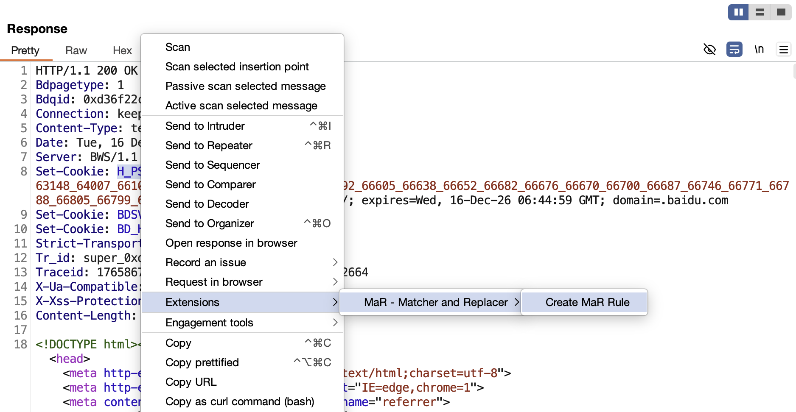
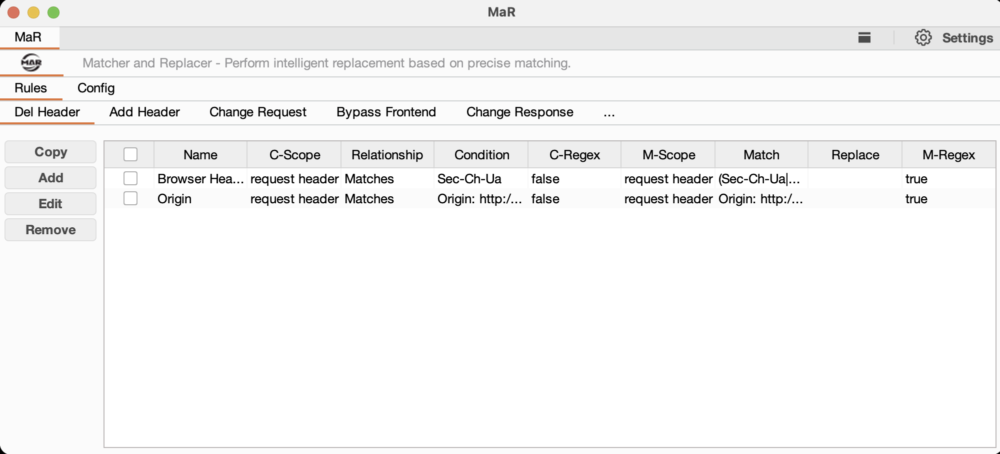
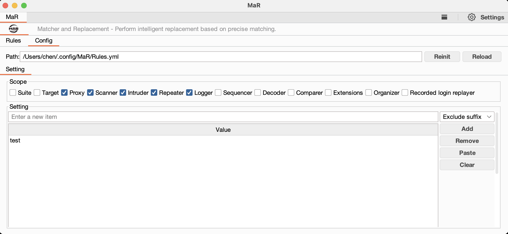

<h4><a href="https://github.com/gh0stkey/MaR">Perform intelligent replacement based on precise matching.</a></h4>
<h5>First Author: <a href="https://github.com/gh0stkey">EvilChen</a> Second Author: <a href="https://github.com/0chencc">0chencc</a> (Mystery Security Team)</h5>

README Version: \[[English](README.md) | [简体中文](README_CN.md)\]

## Project Introduction

**MaR** (Matcher and Replacer) is an auxiliary project in the field of cybersecurity (vulnerability research), primarily used for precise matching and intelligent replacement of HTTP protocol packets. It can automatically modify HTTP request or response content based on user-defined rules when specific conditions are met, helping security researchers achieve automated data tampering during penetration testing.

The design concept of **MaR** originates from BurpSuite's native Match and Replace functionality, but provides more flexible and powerful rule configuration capabilities, supporting conditional matching, regular expressions, multiple scopes, and other advanced features.

**Notes**:

1. MaR is developed using the `Montoya API`. You need BurpSuite version (>=2023.12.1) to use it.

## Usage

**Plugin Installation**: `Extender - Extensions - Add - Select File - Next`

When you load `MaR` for the first time, it will automatically create the configuration file `Config.yml` and rules file `Rules.yml`:

1. For Linux/Mac users: `~/.config/MaR/`
2. For Windows users: `%USERPROFILE%/.config/MaR/`

In addition, you can also choose to place the configuration files in the `/.config/MaR/` directory under the same folder as the `MaR Jar package`, **for easier offline portability**.

### Practical Tips

You can select text in the HTTP request/response editor, right-click and choose "Create MaR Rule" to quickly create a rule. The selected text will be automatically filled into the condition and match fields.

### Functional Description

**Rule Configuration Items**:

| Item | Description |
| ---- | ----------- |
| Name | Rule name, used to identify the rule |
| C-Scope | Condition scope, specifies which part to check the condition |
| Relationship | Match relationship, supports "Matches" and "Does not match" |
| Condition | Condition content, used to determine whether to execute replacement |
| C-Regex | Whether the condition uses regular expression |
| M-Scope | Replacement scope, specifies which part to execute replacement |
| Match | Match content, the content to be replaced |
| Replace | Replace content, the new content after replacement |
| M-Regex | Whether the replacement uses regular expression |

**Supported Scopes**:

- `request` - Full request
- `request method` - Request method
- `request uri` - Request URI
- `request header` - Request headers
- `request body` - Request body
- `response` - Full response
- `response status` - Response status code
- `response header` - Response headers
- `response body` - Response body

**Configuration Management**:

1. **Exclude suffix** - Exclude requests with specified suffixes to avoid processing static resources
2. **Block host** - Exclude requests to specified domains
3. **Scope** - Select which BurpSuite modules MaR applies to (Proxy, Repeater, Intruder, etc.)

### Interface Information

| Interface Name | Interface Display |
| -------------- | --------------------- |
| Rules |  |
| Config |  |

## Use Cases

1. **Parameter Tampering** - Automatically modify request parameter values based on conditions
2. **Response Modification** - Modify response content to bypass frontend validation
3. **Request Injection** - Automatically add or modify request/response headers

## Appreciation List

We appreciate everyone's support for the project. The following list is sorted based on the time of appreciation and is not in any particular order. If there are any omissions, please contact the project author for additions.

| ID       | Amount     |
| -------- | -------- |
| 柯林斯  | 888.00 CNY |
| JaveleyQAQ | 50.00 CNY |
| Kite | 20.00 CNY |
| ArG3 | 66.00 CNY |

## Support the Project

If you find MaR useful, you can show your appreciation by donating to the author, giving them the motivation to continue updating and improving it!

